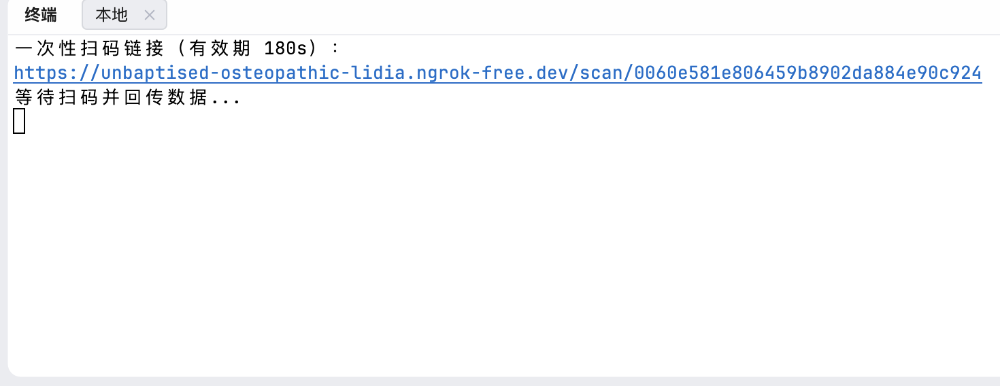

# `XMU Rollcall bot for qrCode`

### [English](README.md)

> **写在前面**
> 
> 我们意识到扫码步骤是不可避免的，不像四位签到码可以遍历，能做的只有如何 **简化** 远程扫码的流程。
> 
> *感谢 [@wilinz](https://www.github.com/wilinz),他为他们的学校开发了 Tronclass 的移动端应用, 实现了一台手机登录多个账号，同时完成签到的功能。*
> 
> 所以我们开发了这个工具，你不再需要拨打视频通话，或是利用会议软件的屏幕共享功能，你只需要运行这个程序，然后把生成的链接发给在教室里的同学，他们打开链接，然后摄像头对准二维码，就好了。这个生成的临时链接是不需要 VPN 访问的。
> 
> 原理上，签到的方法和数字、雷达是一样的，直接 `PUT` 即可，只不过载荷中的 `data` 字段是随时间变化的，所以扫码的步骤不可避免。在扫码后程序将自动解析内容，把需要的 `data` 值提取出来，然后作为载荷发起 `PUT` 请求完成签到。
> 
> 载荷结构如下:
> ```aiignore
> {
>    "data": "需要扫码获取的动态值",
>    "deviceId": "设备标识符，这里我们采用随机生成的UUID"
> }
> ```
> 
> 此仓库仅由于扫码模块的开发与测试，未来将集成到 [XMU Rollcall bot](https://github.com/KrsMt-0113/XMU-Rollcall-Bot)，但你根据下面步骤仍然可以用该项目实现扫码签到。

> 是的没错，对不起，用的还是和数字/雷达签到一样的 PUT，献丑了。

### 致谢 

感谢 [@laigure](https://github.com/laigure) 对本仓库测试做出的贡献。

### 第一步: 安装依赖

```bash
  pip install -r requirements.txt
```

### 第二步: 填写配置文件

在 `config.json` 中填写配置文件，包括 **你自己的** 用户名、密码以及 `ngrok token`(即前三项)。

> 关于 `ngrok token` 的获取，请前往 [ngrok官网](https://ngrok.com/) 注册并登录后，在 "Your Authtoken" 选项卡复制即可。

```aiignore
{
  "username": "your_username",
  "password": "your_password",
  "ngrok_token": "your_ngrok_token",
  "session_timeout": 180
}
```

### 第三步 运行主程序

```bash
  python main.py
```

### 第四步 按指示完成操作



- 程序会生成一个 180 秒有效的 **临时链接**，将该链接发送给 **在教室里的同学**，链接打开后就是一个扫码界面，让他们把手机对准二维码即可。

- 如果终端显示 "签到成功!"，表示签到成功，如果不放心，你可以 **在平台上的签到列表进行二次确认**。

    - 如果没成功，也可能是因为运气不好扫到了恰好刷新前的二维码，那么这时程序会生成新的临时链接，重新发送给你的同学即可。


